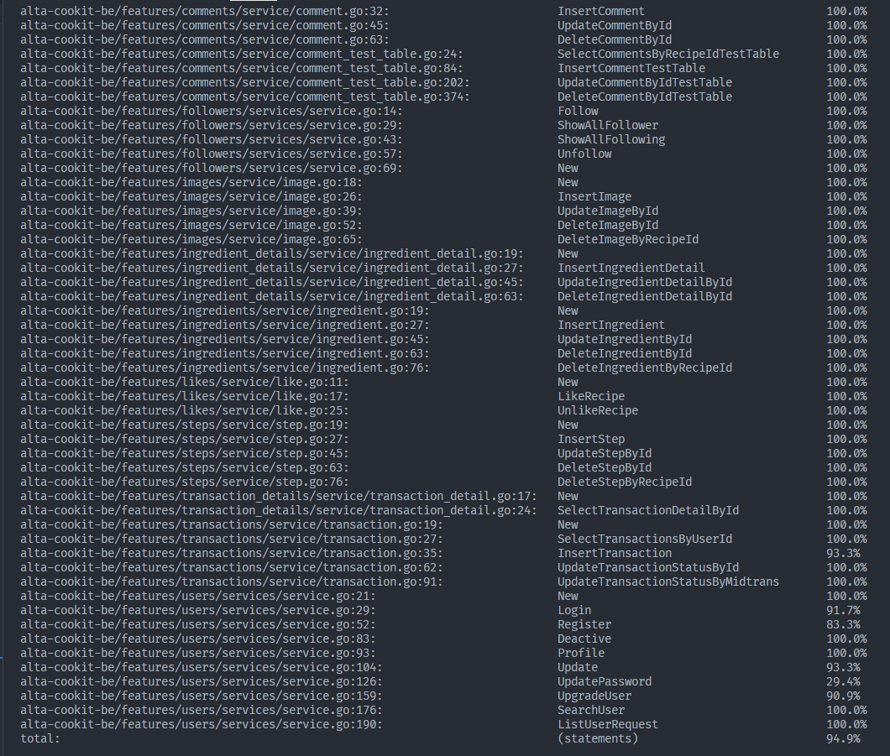

# COOKIT

<div align="center">
  <a href="">
    
  </a>

  <p align="center">
    Capstone Program Immersive Alterra Academy
    <br />
    <a href="https://app.swaggerhub.com/apis-docs/STARCON10_1/ALTA-Cookit-BE/1.0"><strong>| Open API Documentation |</strong></a>
    <br />
    <br />
  </p>
</div>

## 🧑‍💻 About the Project

<p align="justify">COOKIT is a web application-based social media that is useful for finding food recipes online. You can get food recipes from all over the world at COOKIT. Users can not only upload homemade recipes but can also upload re-cooking results. Users can also like recipes and follow other users. Users can also sell ingredients at COOKIT, but only verified users can sell them.</p>

## 🛠 Technology Stack

<div align="center">

  </div>

# 🔗 ERD

<div align="center">

  </div>

# ⚡ Features

<details>
  <summary>🎫 Auth</summary>
  
| Method      | Endpoint            | Params      |q-Params            | JWT Token   | Function                                |
| ----------- | ------------------- | ----------- |--------------------| ----------- | --------------------------------------- |
| POST        | /register           | -           |-                   | NO         | Register a new User                |
| POST        | /login      | -           |-                   | NO         | Login to the system        |
  
</details>

<details>
  <summary>🙍‍♂️ Users</summary>
  
| Method      | Endpoint            | Params      |q-Params            | JWT Token   | Function                                |
| ----------- | ------------------- | ----------- |--------------------| ----------- | --------------------------------------- |
| GET        | /users           | -           |-                   | YES         | Show profile                |
| PUT        | /users      | -           |-                   | YES         | Update profile data        |
| DELETE        | /users      | -           |-                   | YES         | Delete user data        |
| GET        | /users/search      | -           |-                   | YES         | Search another users with username        |
| PUT        | /users/password      | -           |-                   | YES         | Update password account        |
| GET        | /users/(user_id)      | -           |- user_id                  | YES         | Show another user profile        |
| GET        | /users/follower      | -           |-                   | YES         | Show list follower        |
| GET        | /users/following      | -           |-                   | YES         | Show list following        |
| GET        | /users/upgrade      | -           |-                   | YES         | Request upgrade account        |
</details>

<details> 
    <summary>👮 Admin </summary>
| Method      | Endpoint            | Params      |q-Params            | JWT Token   | Function                                |
| ----------- | ------------------- | ----------- |--------------------| ----------- | --------------------------------------- |
| GET        | /users/listverify           | -           |-                   | YES         | Show list for user request upgrading account                |
| PUT        | /users/approval/(user_id)      | -           |- user_id                  | YES         | Accepting or deny user request upgrade account for admin        |
</details>

<details> 
    <summary>🙋‍♂️ Followers </summary>
| Method      | Endpoint            | Params      |q-Params            | JWT Token   | Function                                |
| ----------- | ------------------- | ----------- |--------------------| ----------- | --------------------------------------- |
| POST        | /users/follow/(user_id)           | -           |- user_id                  | YES         | Following another user                |
| DELETE        | /users/unfollow/(user_id)      | -           |- user_id                  | YES         | Unfollow users        |
</details>

<details> 
    <summary>🍳 Recipes</summary>
| Method      | Endpoint            | Params      |q-Params            | JWT Token   | Function                                |
| ----------- | ------------------- | ----------- |--------------------| ----------- | --------------------------------------- |
| GET        | /recipes           | -           |-                   | NO         | Show list recepies                |
| POST        | /recipes      | -           |-                   | YES         | Insert new recipe        |
| PUT        | /recipes(recipe_id)      | -           |-  recipe_id                 | YES         | Update recipe        |
| DELETE        | /recipes(recipe_id)      | -           |-  recipe_id                 | YES         | Delete recipe by recipe_id        |
| GET        | /users/recipes/timeline      | -           |-                   | YES         | Show timeline recipes        |
| GET        | /recipes/trending      | -           |-                   | YES         | Show trending recipes        |
| GET        | /recipes/(recipe_id)/detail      | -           |-  recipe_id                 | NO         | Show detail recipes        |
| POST        | /recipes/(recipe_id)/like      | -           |-  recipe_id                 | YES         | Like recipes        |
| DELETE        | /recipes/(recipe_id)/unlike      | -           |-  recipe_id                 | YES         | Unlike recipes        |
</details>

<details> 
    <summary>🖼️ Images</summary>
| Method      | Endpoint            | Params      |q-Params            | JWT Token   | Function                                |
| ----------- | ------------------- | ----------- |--------------------| ----------- | --------------------------------------- |
| POST        | /recipes/(recipe_id)/images           | -           |- recipe_id                  | YES         | Insert new recipes image                |
| DELETE        | /recipes/(recipe_id)/images      | -           |- recipe_id                  | YES         | Delete recipes image        |
| PUT        | /recipes/(recipe_id)/images/(image_id)      | -           |- recipe_id and image_id                 | YES         | Update recipes image        |
| DELETE        | /recipes/(recipe_id)/images/(image_id)      | -           |- recipe_id and image_id                  | YES         | Delete recipes image        |
</details>

<details> 
    <summary>💬 Comments</summary>
| Method      | Endpoint            | Params      |q-Params            | JWT Token   | Function                                |
| ----------- | ------------------- | ----------- |--------------------| ----------- | --------------------------------------- |
| POST        | /recipes/(recipe_id)/comments           | -           |- recipe_id                  | YES         | Create comment in recipes                |
| DELETE        | /recipes/(recipe_id)/comments/(comment_id)      | -           |- recipe_id and comment_id                  | YES         | Delete comment in recipes        |
| PUT        | /recipes/(recipe_id)/comments/(comment_id)      | -           |- recipe_id and comment_id                 | YES         | Update comment in recipe        |
| GET        | /recipes/(recipe_id)/comments      | -           |- recipe_id                  | NO         | Get list comment in recipes        |
</details>

<details> 
    <summary>🪜 Steps</summary>
| Method      | Endpoint            | Params      |q-Params            | JWT Token   | Function                                |
| ----------- | ------------------- | ----------- |--------------------| ----------- | --------------------------------------- |
| POST        | /recipes/(recipe_id)/steps          | -           |- recipe_id                  | YES         | Create new recipes step               |
| DELETE        | /recipes/(recipe_id)/steps      | -           |- recipe_id                  | YES         | Delete recipes steps        |
| PUT        | /recipes/(recipe_id)/steps/(step_id)      | -           |- recipe_id and step_id                 | YES         | Update steps in recipe        |
| DELETE        | /recipes/(recipe_id)/steps/(step_id)      | -           |- recipe_id and step_id                  | YES         | Delete steps in recipes        |
</details>

<details> 
    <summary>🍅 Ingredients</summary>
| Method      | Endpoint            | Params      |q-Params            | JWT Token   | Function                                |
| ----------- | ------------------- | ----------- |--------------------| ----------- | --------------------------------------- |
| POST        | /recipes/(recipe_id)/ingredients          | -           |- recipe_id                  | YES         | Create new recipes ingredient               |
| DELETE        | /recipes/(recipe_id)/ingredients      | -           |- recipe_id                  | YES         | Delete recipes ingredients        |
| PUT        | /recipes/(recipe_id)/ingredients/(ingredient_id)      | -           |- recipe_id and ingredient_id                 | YES         | Update ingredients in recipe        |
| DELETE        | /recipes/(recipe_id)/ingredients/(ingredient_id)      | -           |- recipe_id and ingredient_id                  | YES         | Delete ingredients in recipes        |
</details>

<details> 
    <summary>🥕 Ingredients Detail</summary>
| Method      | Endpoint            | Params      |q-Params            | JWT Token   | Function                                |
| ----------- | ------------------- | ----------- |--------------------| ----------- | --------------------------------------- |
| POST        | /recipes/(recipe_id)/ingredients/(ingredient_id)/ingredientDetails          | -           |- recipe_id and ingredient_id                  | YES         | Create new ingredients detail               |
| PUT        | /recipes/(recipe_id)/ingredients/ingredientDetails/(ingredient_detail_id)      | -           |- recipe_id and ingredient_detail_id                 | YES         | Update ingredients detail        |
| DELETE        | /recipes/(recipe_id)/ingredients/ingredientDetails/(ingredient_detail_id)      | -           |- recipe_id and ingredient_detail_id                  | YES         | Delete ingredients detail        |
</details>

<details> 
    <summary>🛒 Carts</summary>
| Method      | Endpoint            | Params      |q-Params            | JWT Token   | Function                                |
| ----------- | ------------------- | ----------- |--------------------| ----------- | --------------------------------------- |
| GET        | /users/carts      | -           |-                   | YES         | Get list carts        |
| POST        | /users/carts           | -           |-                   | YES         | Create new cart                |
| PUT        | /users/carts/(cart_id)      | -           |- cart_id                 | YES         | Update users cart        |
| DELETE        | /users/carts/(cart_id)      | -           |- cart_id                  | YES         | Delete users cart        |
</details>

<details> 
    <summary>🛍️ Transactions</summary>
| Method      | Endpoint            | Params      |q-Params            | JWT Token   | Function                                |
| GET        | /users/transactions      | -           |-                   | YES         | Get list transactions        |
| ----------- | ------------------- | ----------- |--------------------| ----------- | --------------------------------------- |
| POST        | /users/transactions           | -           |-                   | YES         | Create new transactions                 |
| PUT        | /users/transactions/(transaction_id)/status      | -           |- cart_id                 | YES         | Update users status transactions        |
</details>

<details> 
    <summary>🛍️ Transactions Details</summary>
| Method      | Endpoint            | Params      |q-Params            | JWT Token   | Function                                |
| ----------- | ------------------- | ----------- |--------------------| ----------- | --------------------------------------- |
| GET        | /users/transactions/transaction_detail/(transaction_detail_id)      | -           |-                   | YES         | Get list users transaction detail       |
</details>

## How to Install To Your Local And Run

- Clone it

```
$ git clone https://github.com/Cookit-group-1/ALTA-Cookit-BE.git
```

- Go to directory

```
$ cd ALTA-Cookit-BE
```

- Run the project

```
$ go run .
```

- Voila! 🪄

# UNIT TEST COVERAGE ALL



## Authors 👑

- Andreas <br> [](https://github.com/Velocyes)

- Alfian Aditya <br> [](https://github.com/alfianadityads)

 <p align="right">(<a href="#top">back to top</a>)</p>
<h3>
<p align="center">Built with ❤️ by Cookit Team</p>
<p align="center">©️ April 2023 </p>
</h3>
