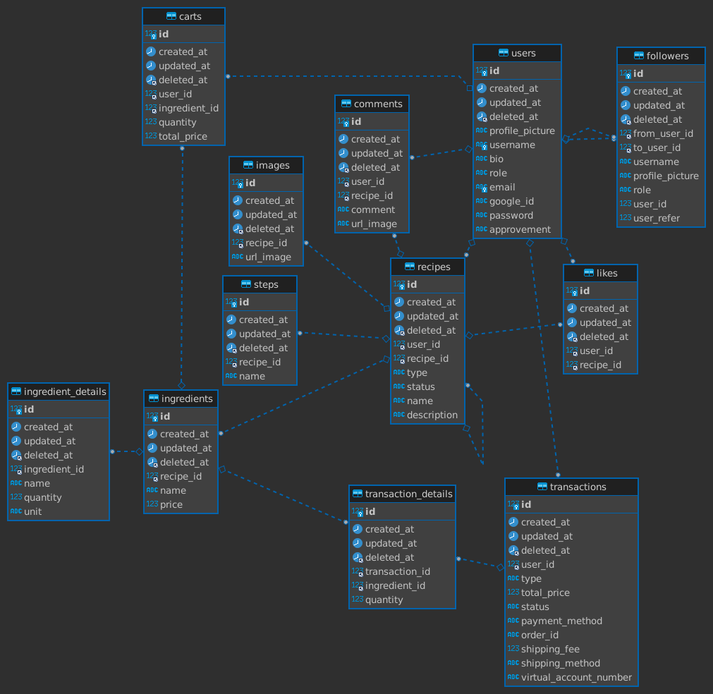

# COOKIT

  

  

    Capstone Program Immersive Alterra Academy
     
    <a href="https://app.swaggerhub.com/apis-docs/STARCON10_1/ALTA-Cookit-BE/1.0"><strong>| Open API Documentation |</strong></a>
     
     
  

## 🧑‍💻 About the Project

COOKIT is a web application-based social media that is useful for finding food recipes online. You can get food recipes from all over the world at COOKIT. Users can not only upload homemade recipes but can also upload re-cooking results. Users can also like recipes and follow other users. Users can also sell ingredients at COOKIT, but only verified users can sell them.

## 🛠 Technology Stack

  

# 🔗 ERD

  

# ⚡ Features

  
🎫 Auth

  
| Method      | Endpoint            | Params      |q-Params            | JWT Token   | Function                                |
| ----------- | ------------------- | ----------- |--------------------| ----------- | --------------------------------------- |
| POST        | /register           | -           |-                   | NO         | Register a new User                |
| POST        | /login      | -           |-                   | NO         | Login to the system        |
  

  
🙍‍♂️ Users

  
| Method      | Endpoint            | Params      |q-Params            | JWT Token   | Function                                |
| ----------- | ------------------- | ----------- |--------------------| ----------- | --------------------------------------- |
| GET        | /users           | -           |-                   | YES         | Show profile                |
| PUT        | /users      | -           |-                   | YES         | Update profile data        |
| DELETE        | /users      | -           |-                   | YES         | Delete user data        |
| GET        | /users/search      | -           |-                   | YES         | Search another users with username        |
| PUT        | /users/password      | -           |-                   | YES         | Update password account        |
| GET        | /users/(id)      | -           |- ID                  | YES         | Show another user profile        |
| GET        | /users/follower      | -           |-                   | YES         | Show list follower        |
| GET        | /users/following      | -           |-                   | YES         | Show list following        |
| GET        | /users/upgrade      | -           |-                   | YES         | Request upgrade account        |

 
    
👮 Admin 

| Method      | Endpoint            | Params      |q-Params            | JWT Token   | Function                                |
| ----------- | ------------------- | ----------- |--------------------| ----------- | --------------------------------------- |
| GET        | /users/listverify           | -           |-                   | YES         | Show list for user request upgrading account                |
| PUT        | /users/approval/(id)      | -           |- ID                  | YES         | Accepting or deny user request upgrade account for admin        |

 
    
🙋‍♂️ Followers 

| Method      | Endpoint            | Params      |q-Params            | JWT Token   | Function                                |
| ----------- | ------------------- | ----------- |--------------------| ----------- | --------------------------------------- |
| POST        | /users/follow/(id)           | -           |- ID                  | YES         | Following another user                |
| DELETE        | /users/unfollow/(id)      | -           |- ID                  | YES         | Unfollow users        |

